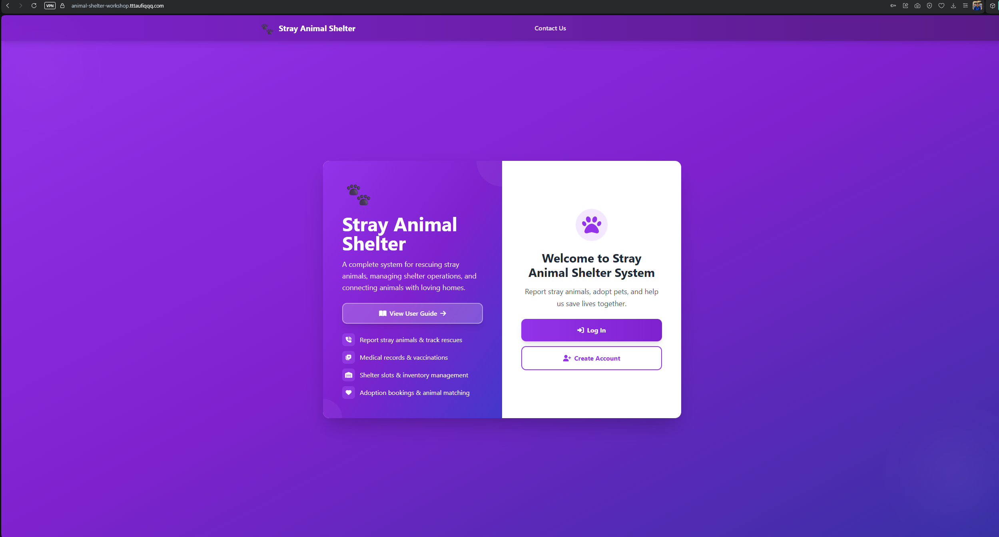
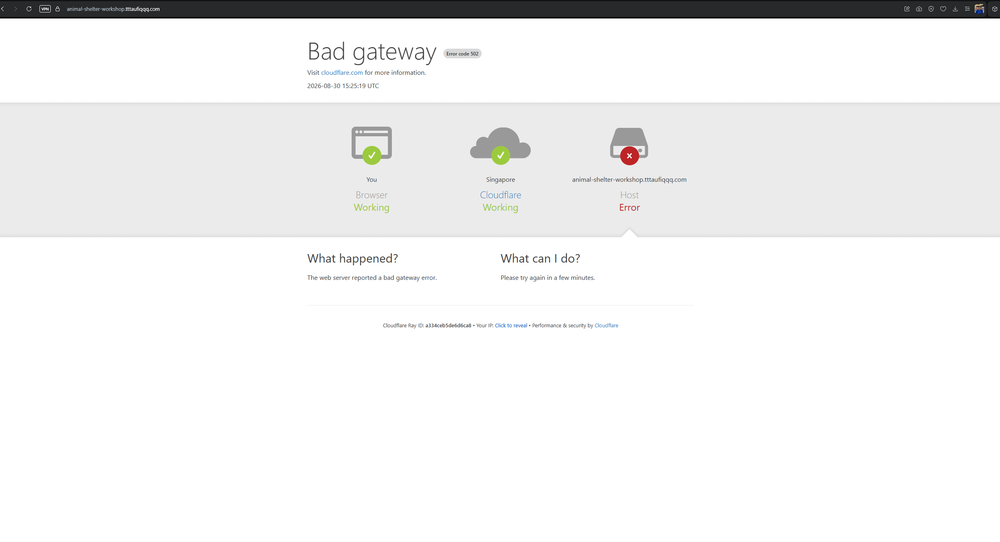
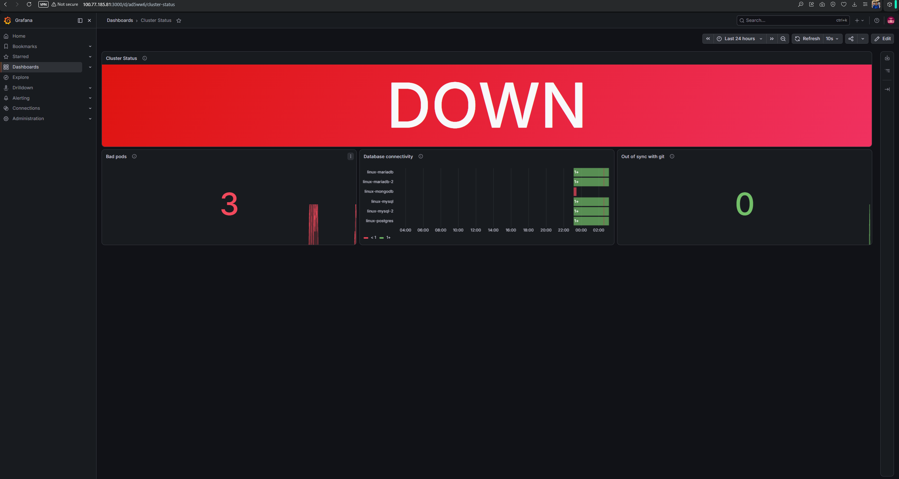
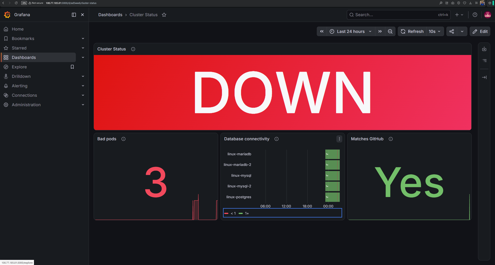
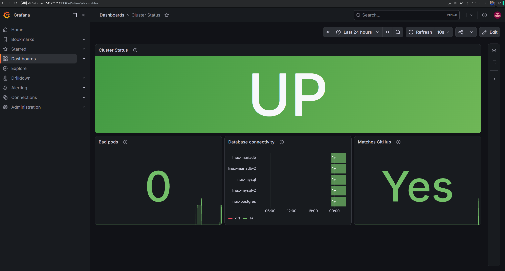

# The Cluster Status Dashboard, and a Deliberate Incident Drill

**Date:** 2026-08-30 to 2026-08-31

## Why I built this

- Stage 6/doc 14 gave the fleet host-level metrics and logs, but nothing
  that understood Kubernetes itself: a crash-looping pod or a stuck
  rollout was invisible to Grafana/Alertmanager the whole time, only
  ever visible via `kubectl`.
- Wanted to actually prove the monitoring stack is useful for the k3s
  cluster specifically, not just assert it, by deliberately causing
  real incidents (a deleted pod, a crash-looping deployment, a bad
  config pushed through git, a full outage) and watching whether they
  showed up, whether they auto-healed, and fixing the ones that
  couldn't.
- The dashboard went through two names and two shapes: it started as
  `k3s Cluster Health`, a 9-panel build-out covering everything I could
  think to scrape. Once it existed, the real question turned out to be
  simpler than the dashboard: "is the cluster down or not". Redesigned
  it down to 4 panels and renamed it `Cluster Status` to match what it
  actually answers.

## Flow

```
┌────────────────────────────────────┐
│  CLUSTER STATUS DASHBOARD           │▏
└────────────────────────────────────┘▔▔

┌────────────────────────────────┐     found, admin login locked out
│ 0. Grafana access recovery       │▏    by brute-force protection, not
└────────────────────────────────┘▔▔    a wrong password
              │
              ▼
┌────────────────────────────────┐     done, new NodePort service +
│ 1. kube-state-metrics deployed   │▏    ClusterRole, pod/deployment
└────────────────────────────────┘▔▔    state now scraped
              │
              ▼
┌────────────────────────────────┐     done, deleted a pod live,
│ 2. First fire-drill               │▏    Loki caught it in detail,
└────────────────────────────────┘▔▔    Prometheus/Grafana saw nothing
              │
              ▼
┌────────────────────────────────┐     broke, then fixed: the alert's
│ 3. PodCrashLooping alert bug      │▏    own gauge metric flickers to
└────────────────────────────────┘▔▔    absent, switched to a counter
              │
              ▼
┌────────────────────────────────┐     done, exposed argocd_app_info
│ 4. ArgoCD sync/health visibility │▏    past a NetworkPolicy block,
└────────────────────────────────┘▔▔    proved selfHeal reverts in <30s
              │
              ▼
┌────────────────────────────────┐     done, blackbox_exporter TCP
│ 5. Real database connectivity     │▏    probes, scoped to the app's
└────────────────────────────────┘▔▔    actual 5 DB connections
              │
              ▼
┌────────────────────────────────┐     done, a bad nginx config pushed
│ 6. The un-healable incident       │▏    via git, GitOps can't fix
└────────────────────────────────┘▔▔    what git itself says is correct
              │
              ▼
┌────────────────────────────────┐     done, deleted the last healthy
│ 7. Escalated to a real outage     │▏    pod's ReplicaSet, real 502
└────────────────────────────────┘▔▔    on the public site
              │
              ▼
┌────────────────────────────────┐     done, reverted via git, ArgoCD
│ 8. Fixed and verified              │▏    synced, forced pod restart,
└────────────────────────────────┘▔▔    confirmed at every layer
              │
              ▼
┌────────────────────────────────┐     done, 9 panels cut to 4, one
│ 9. Redesigned into Cluster Status│▏    hero verdict plus minimal
└────────────────────────────────┘▔▔    supporting context
              │
              ▼
┌────────────────────────────────┐     found twice more, live: a
│ 10. Two more bugs, found live     │▏    stale mongodb reading, and the
└────────────────────────────────┘▔▔    same flicker bug in a new panel
              │
              ▼
┌────────────────────────────────┐     done, redid the whole incident
│ 11. Replayed the drill              │▏    end to end on the redesigned
└────────────────────────────────┘▔▔    dashboard, captured it live
```

## What I built

### 0. Grafana access recovery

- The documented admin password (`admin` / `qwertY@1612`) kept failing
  even after a fresh `grafana-cli`/`grafana cli` reset.
- Root cause: Grafana's brute-force login protection had the account
  temporarily locked from earlier failed attempts, a state stored in
  the `login_attempt` SQLite table that survives a service restart.
- Fixed by clearing that table directly (`DELETE FROM login_attempt`)
  rather than waiting out the lockout window.

### 1. `kube-state-metrics`, so Kubernetes object state is actually scraped

- New Deployment + ClusterRole + ClusterRoleBinding + NodePort Service
  (`k8s/kube-state-metrics.yaml`, `Animal-Shelter-Workshop` repo),
  applied directly to the cluster first to verify, then committed.
- NodePort (`:30081`), not ClusterIP: Prometheus lives outside the
  cluster on `linux-observability`, so it can't reach a ClusterIP-only
  Service. Same reasoning as `node_exporter`'s Tailscale-IP pattern.
- New Prometheus scrape job, and a new dashboard, built via Grafana's
  HTTP API.

### 2. First fire-drill: deleting a running `asw-app` pod

- Deleted one of 3 `asw-app` replicas live. ReplicaSet recreated it in
  4 seconds.
- **Loki caught the whole thing in detail:** the old pod's graceful
  shutdown (`php-fpm: NOTICE: exiting, bye-bye!`, Vault Agent's own
  shutdown sequence) and the new pod's full startup, both queryable by
  pod name in Grafana Explore.
- **Prometheus/Alertmanager/the dashboard saw nothing:** `up` never
  blipped, no alert fired, no panel changed. Proved the split cleanly:
  this stack has real forensic value, zero proactive value, at the pod
  layer specifically.

### 3. The `PodCrashLooping` alert had a real bug, found by testing it live

- First version: `kube_pod_container_status_waiting_reason{reason="CrashLoopBackOff"} == 1`
  with `for: 5m`.
- Deployed a disposable crash-looping pod (`busybox` running `exit 1`)
  to fire-test it. It never fired, flapped `pending`/`inactive` for
  10+ minutes.
- **Root cause:** that gauge metric briefly disappears every time the
  container cycles through `Terminated`/`Running` between backoff
  cycles, resetting Prometheus's `for:` continuity clock before it
  ever reaches the threshold.
- **Fixed** by switching to `increase(kube_pod_container_status_restarts_total[15m]) > 3`.
  A counter increase doesn't need unbroken continuity, only two
  points in time. Fired correctly within minutes on the same test pod.
- This same root cause resurfaced twice more later, once in the
  dashboard itself (section 10) and would have hit `PodStuckWaiting`
  too (section 6) had that alert's failure mode behaved the same way.

### 4. ArgoCD sync/health visibility: closing the "manual SSH change" gap

- Asked directly: would this stack notice someone SSHing into a node
  and changing something by hand? Answer at the time: partially. Loki
  has the audit trail, but nothing pipes ArgoCD's own drift-detection
  into Grafana/Alertmanager.
- ArgoCD's `argocd_app_info` metric (`sync_status`, `health_status`)
  already exists on its `argocd-metrics` Service, but that Service is
  ClusterIP-only, **and** a NetworkPolicy
  (`argocd-application-controller-network-policy`) blocks NodePort-
  sourced traffic to it (allows pod-to-pod ingress only).
- Fixed with a companion NodePort Service + a second, additive
  NetworkPolicy scoped to just the metrics port
  (`k8s/argocd-metrics-nodeport.yaml`), which doesn't edit ArgoCD's own
  resource since NetworkPolicies are additive.
- New alert rules: `ArgoCDAppOutOfSync`, `KubeStateMetricsDown` (fills
  a real blind spot: `InstanceDown` only watches `job="node"`, so k3s
  itself breaking while the VM stays up would otherwise go unnoticed).
- **Proved live:** manually scaled `asw-redis` from 1 to 2 replicas by
  hand. ArgoCD's `selfHeal` reverted it in under 30 seconds, faster
  than a single 15s Prometheus scrape could catch the transient
  `OutOfSync` state.
- **Second, more conclusive proof:** deleted the entire `asw-nginx`
  Deployment outright. ArgoCD rebuilt it from git. This time the
  rebuild took long enough (a few seconds of genuinely missing pods)
  for Prometheus to land a real sample mid-recovery: a clean,
  verified `27 to 24 to 27` running-pod dip and `0 to 3 to 0`
  unavailable-replica spike, both real scraped data points, not
  simulated.

### 5. Real database connectivity: not just "is the VM up"

- Realized `node_exporter` only ever proves the DB *host* is up, never
  that the database *process* inside it is actually accepting
  connections: mysqld could crash and nothing would notice.
- Installed `blackbox_exporter` on `linux-observability`, doing real
  TCP-connect probes against each database's actual port.
- Had to add a new UFW rule on all 5 DB hosts (`roles/db_firewall`):
  each host's firewall only allowed specific known sources (app-server,
  linux-k3s, linux-gh-runner) before, not the observability host.
- New `DatabaseUnreachable` alert.
- Initially included `linux-mongodb` as a 6th target, matching the
  original Stage 6 host list. Checked whether `asw-app` actually uses
  it: a full codebase search turned up zero references, and
  `docs/03-db-architecture.md` (`Animal-Shelter-Workshop` repo)
  explicitly confirms MongoDB on this homelab is for **a different,
  unrelated learning project**, so it was removed from the Prometheus
  scrape config entirely. It still resurfaced once more anyway, see
  section 10.

### 6. The un-healable incident, on purpose

- Every incident tested up to this point (deleted pod, deleted
  Deployment, manual scale) got auto-corrected by Kubernetes or ArgoCD,
  because git still declared the "correct" state underneath.
- Deliberately pushed a genuinely broken nginx config
  (`not_a_real_directive on;`, an invalid directive) into
  `k8s/nginx-configmap.yaml` and committed/pushed it for real.
- ArgoCD synced it faithfully. As far as GitOps is concerned, that
  broken config **is** the desired state, so `selfHeal` had nothing to
  revert. A ConfigMap change alone doesn't restart already-running
  pods, so the existing (good) pods kept serving traffic until a
  `kubectl rollout restart` forced them to read the new, broken config.
- All 3 new pods immediately hit `CrashLoopBackOff` (nginx fails its
  own config validation on startup). `PodCrashLooping` fired correctly
  to Telegram for all 3.
- A second, narrower alert added during this drill,
  `PodStuckWaiting` (catches `ImagePullBackOff`-style permanent-wait
  failures the restart-counter-based alert can't see, since a
  container that never starts never increments a restart count),
  turned out **not** to fire here, for the same flicker reason as
  finding #3: this particular failure mode still cycles through
  `Terminated`/`Waiting`, unlike a truly stuck image pull. Left as a
  documented, honest limitation rather than a false claim of coverage.

### 7. Why the site kept working, then didn't

- Despite 3 pods crash-looping, the site stayed up: Kubernetes' rolling
  update strategy refused to fully retire the old ReplicaSet's one
  surviving pod (still on the working config) since the new pods never
  passed readiness. The Service only ever routes to `Ready` pods, so
  100% of real traffic kept landing on that single old survivor.
- To actually cause a real, visible outage (not just a degraded state),
  deleted that old ReplicaSet outright.
- Confirmed for real: `kube_deployment_status_replicas_available` for
  `asw-nginx` dropped to `0`, and `https://animal-shelter-workshop.tttaufiqqq.com`
  returned a genuine Cloudflare `502 Bad Gateway`.





### 8. The first fix, and full verification

- Diagnosed: `not_a_real_directive on;` in `k8s/nginx-configmap.yaml`,
  committed deliberately in the break, was still live.
- Fixed the only way that actually sticks under GitOps: reverted the
  line and pushed a new commit. A live `kubectl edit` would have just
  been reverted back to the broken state by `selfHeal`.
- ArgoCD synced the corrected ConfigMap into the cluster in about 10
  seconds. Since a ConfigMap change doesn't restart running pods on its
  own, ran `kubectl rollout restart deployment/asw-nginx` to force the
  crash-looping pods to pick up the fix immediately instead of waiting
  out their next backoff cycle.
- Verified recovery independently at every layer, not just "pods look
  running": the actual public URL (`200`), the raw
  `kube_deployment_status_replicas_available` metric (`3`), and
  ArgoCD's own health status (`Synced` / `Healthy`, no longer stuck
  `Progressing`) all agreed.

### 9. Redesigned into `Cluster Status`

- The 9-panel `k3s Cluster Health` dashboard worked, but it answered
  too many questions at once. The one that actually matters for a
  glance-and-know check is simpler: is the cluster down or not.
- Cut it down to 4 panels, and renamed the dashboard `Cluster Status`
  to match:
  - **Cluster Status**, a single hero verdict, `UP` or `DOWN`, combining
    three checks into one: no deployment is missing replicas, no pod
    is stuck in a bad state, and the cluster's own metrics endpoint
    answers.
  - **Bad pods**, a count of pods currently in a bad waiting state.
  - **Database connectivity**, the same TCP-probe panel from section 5,
    kept as is.
  - **Matches GitHub**, a plain `Yes`/`No` (renamed and reframed from
    the earlier "apps out of sync" count) instead of a raw number.
- Every panel tooltip was also rewritten to avoid em dashes entirely,
  plain sentences with periods and commas instead.
- The hero query, combining three independent Prometheus signals into
  one boolean verdict:

```
(
  ((sum(kube_deployment_status_replicas_unavailable) or vector(0)) == bool 0)
  *
  ((sum(max_over_time(kube_pod_container_status_waiting_reason[2m]) == 1) or vector(0)) == bool 0)
  *
  (sum(up{job="kube-state-metrics"}) or vector(0))
)
```

- Every panel that returns a Prometheus gauge got the same `or vector(0)`
  treatment already used in the original build: an empty result reads
  as an ambiguous "No data" in Grafana, not a reassuring `0`, which is
  exactly the wrong failure mode for a panel meant to prove the system
  works.

### 10. Two more bugs, found live, redesigning in public

**Bug: a removed database kept reappearing**

- `linux-mongodb` had already been removed from Prometheus's scrape
  config back in section 5, for good reason: it's not one of
  `asw-app`'s actual databases.
- It still showed up in the new "Database connectivity" panel anyway.
  Not a live scrape, a `state-timeline` panel renders the full history
  within its time window, and the "Last 24 hours" default still
  included mongodb's old data points from before it was descoped.
- Fixed by explicitly excluding it in the panel query itself
  (`dbname!="linux-mongodb"`) instead of waiting a full day for the
  stale history to age out on its own.



**Bug: the "Bad pods" panel flickered, same root cause as section 3, in a new place**

- Live incident on screen: `Cluster Status` correctly read `DOWN`, but
  `Bad pods` read `0`, on a cluster that genuinely had 3 crash-looping
  pods.
- Same cause as the original `PodCrashLooping` alert bug: the
  `kube_pod_container_status_waiting_reason` gauge briefly disappears
  every restart cycle. The hero panel didn't get fooled because it
  also checks `kube_deployment_status_replicas_unavailable`, a steadier
  signal, but the standalone "Bad pods" panel had nothing to fall back
  on.
- Fixed with `max_over_time(...[2m]) == 1` instead of an instantaneous
  read, the same smoothing technique used for the alert, applied here
  for display instead of alerting.
- **Real tradeoff this introduced, found immediately after fixing it:**
  after a genuine recovery, `Bad pods` and the hero panel can lag up to
  2 minutes behind reality, since they're deliberately looking
  backwards to avoid the flicker. Confirmed live: site back to `200`,
  pods `Running` with 0 restarts, and ArgoCD `Healthy`, all already
  true, while the dashboard still briefly read `DOWN` / `3` until the
  2-minute window aged out.





### 11. Replaying the drill on the redesigned dashboard

- Reran the full incident end to end, specifically to capture it live
  on the new `Cluster Status` dashboard: broke `k8s/nginx-configmap.yaml`
  again, pushed it, forced a rollout restart, watched the site degrade
  then go fully down (deleted the last healthy ReplicaSet again), then
  fixed it the same GitOps way as section 8.
- Confirmed the redesigned dashboard tells the same true story as the
  original: red `DOWN` verdict during the incident, a real `502` on
  the public site, then a clean `UP` a couple of minutes after the fix
  actually landed.



## Credentials touched this session

- Grafana admin password unchanged (`qwertY@1612`). The login issue
  was a stale brute-force lockout, not a wrong credential, fixed by
  clearing Grafana's own `login_attempt` table. Nothing to rotate.

## How to independently verify each item

```bash
# 1. kube-state-metrics + ArgoCD metrics scraping cleanly
curl -s http://100.77.185.81:9090/api/v1/targets | grep -E 'kube-state-metrics|argocd' -A2

# 3. PodCrashLooping fires on a real crash loop
kubectl run crash-test --image=busybox --restart=Always -- sh -c 'exit 1'
# wait ~2 minutes, then:
curl -s http://100.77.185.81:9093/api/v2/alerts | grep PodCrashLooping
kubectl delete pod crash-test

# 4. ArgoCD selfHeal reverts manual drift
kubectl scale deployment asw-redis --replicas=2
# check within seconds:
curl -s http://100.77.185.81:9090/api/v1/query?query=argocd_app_sync_total

# 5. Real DB connectivity
curl -s http://100.77.185.81:9090/api/v1/query?query=probe_success

# 6-8, 11. Full incident replay (reversible, git-tracked)
# see k8s/nginx-configmap.yaml history in the Animal-Shelter-Workshop repo

# 9-10. Cluster Status hero verdict, matches the dashboard exactly
curl -s -G 'http://100.77.185.81:9090/api/v1/query' --data-urlencode \
  'query=((sum(kube_deployment_status_replicas_unavailable) or vector(0)) == bool 0) * ((sum(max_over_time(kube_pod_container_status_waiting_reason[2m]) == 1) or vector(0)) == bool 0) * (sum(up{job="kube-state-metrics"}) or vector(0))'
```

## Where things live

- **Dashboard:** Grafana, `Cluster Status`
  (`http://100.77.185.81:3000/d/ad5ww6/cluster-status`), built
  directly via Grafana's API, not tracked in either git repo.
- **k8s manifests:** `Animal-Shelter-Workshop` repo,
  `k8s/kube-state-metrics.yaml`, `k8s/argocd-metrics-nodeport.yaml`,
  `k8s/nginx-configmap.yaml` (the incident + its fix, twice).
- **Ansible:** `Animal-Shelter-Workshop` repo,
  `infrastructure/ansible/templates/prometheus.yml.j2`,
  `infrastructure/ansible/files/prometheus-alert-rules.yml`,
  `infrastructure/ansible/roles/db_firewall/`.
- **Commits:** `feat(observability): extend Prometheus/Grafana to
  Kubernetes object state`, `test(incident): deliberately break nginx
  config to validate monitoring`, `feat(observability): add real
  database connectivity probes`, `fix(incident): revert deliberate
  nginx config break` (x2, one per replay of the drill), all on
  `Animal-Shelter-Workshop`'s `main`.

## What's still open

- `PodStuckWaiting`'s flicker limitation (finding in section 6) is
  real and undocumented anywhere else: it only reliably catches a
  failure mode that never leaves the `Waiting` state at all (a genuine
  stuck `ImagePullBackOff`), not a crash-on-startup that cycles through
  `Terminated`. Worth a proper fix later, same pattern as the
  `PodCrashLooping` counter-based fix in section 3.
- No alert yet on ArgoCD's `health_status` going `Degraded`/stuck
  `Progressing` directly, only `sync_status` is alerted on. Both
  replays of the incident were caught via `PodCrashLooping`, not via
  ArgoCD health, purely incidentally.
- The `Cluster Status`/`Bad pods` smoothing lag (section 10) is a
  known, accepted tradeoff, not a bug, but it's dashboard-display-only.
  It does not affect the underlying alert rules (`PodCrashLooping`,
  `PodStuckWaiting`), which have their own independent `for:` timing
  and already fire correctly regardless of what the dashboard shows.
